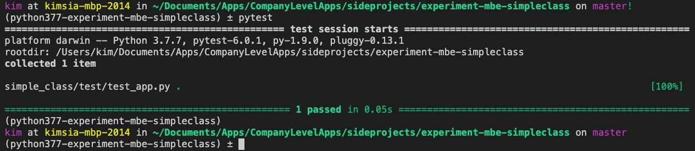

# Experiment MBE SimpleClass
This is an experimental repo to learn model based engineering by doing.

The immediate (and probably intermediate) aim is to produce a python equivalent of the SimpleClass.java

## Structure

I follow https://docs.pytest.org/en/stable/goodpractices.html#tests-as-part-of-application-code
in terms of setting up the folder structure.

As for the canonical Java class and the intermediate semantic models, they are under the folder `canonical`

## works for

Python 3.7.7

## How to run tests

1. Create your own virtualenv running python 3.7.7 for this project and activate it
2. GO to root folder and then install the dependencies with `pip install -r requirements.txt`
3. Type `pytest`

It should look like this:

## Assumptions

1. Use `mypy` because python is not statically typed
2. As far as possible try to indicate the types